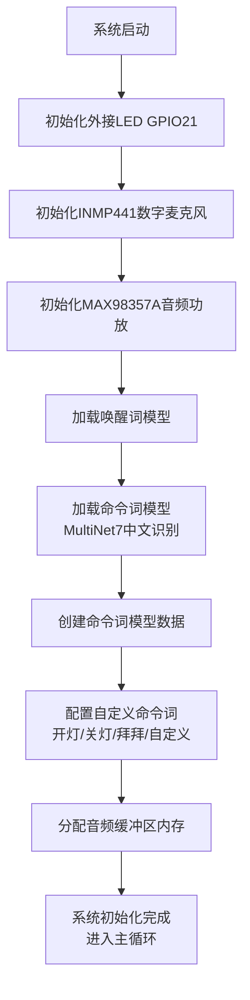
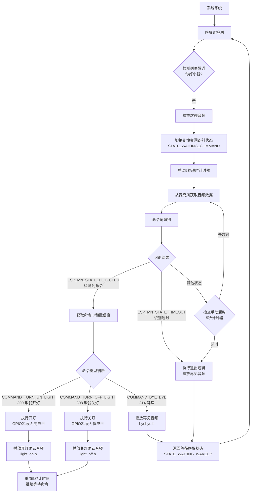

# 🎤 ESP32-S3 智能语音助手 - 复刻小智 AI 语音功能

> **完整复刻小智 AI 的语音交互体验** | 支持语音唤醒、命令识别和音频反馈

**视频教程预告**：我会在 B 站发布详细教程视频《ESP32 复刻小智 AI 语音功能》

## 🌟 本示例代码主要做了什么？

这是一个完整的智能语音助手实现，复刻了小智 AI 的核心语音功能。当你说"你好小智"时，它会播放欢迎音频并进入命令模式。然后你可以说"帮我开灯"、"帮我关灯"等指令，系统会执行相应操作并播放确认音频。

**为什么做这个？**  
很多朋友对小智 AI 的语音交互功能很感兴趣，但不知道如何实现。这个项目展示了完整的语音助手实现方案，包括唤醒、识别、反馈的全流程，让你可以打造属于自己的智能语音助手。

## ⚡ 功能特性

- ✅ **语音唤醒检测** - 支持"你好小智"唤醒词
- ✅ **命令词识别** - 支持"帮我开灯"、"帮我关灯"、"拜拜"等指令
- ✅ **音频反馈播放** - 每个操作都有对应的语音确认
- ✅ **LED 灯控制** - 根据语音指令控制外接 LED
- ✅ **智能超时管理** - 5 秒无指令自动退出，支持连续指令
- ✅ **完全兼容**小智 AI 的硬件接线方式

## 📦 需要准备什么？

### 硬件清单（淘宝都能买到）

| 部件   | 推荐型号           | 备注                       |
| ------ | ------------------ | -------------------------- |
| 开发板 | ESP32-S3-DevKitC-1 | 必须是 S3 版本，需要 PSRAM |
| 麦克风 | INMP441            | 约 5 元/个                 |
| 功放   | MAX98357A          | 约 8 元/个                 |
| 喇叭   | 4Ω 3W 小喇叭       | 约 3 元/个                 |
| LED 灯 | 任意颜色           | 普通发光二极管即可         |

### 接线图（完全按照小智 AI 的接线方式）

```text
麦克风(INMP441) → ESP32开发板
-----------------------------
VDD（麦克风）→ 3.3V（开发板）  // 接电源正极
GND（麦克风）→ GND（开发板）   // 接电源负极
SD  （麦克风）→ GPIO6         // 数据线
WS  （麦克风）→ GPIO4         // 左右声道选择
SCK （麦克风）→ GPIO5         // 时钟线

功放(MAX98357A) → ESP32开发板
-----------------------------
VIN（功放）→ 3.3V（开发板）   // 接电源正极
GND（功放）→ GND（开发板）    // 接电源负极
DIN（功放）→ GPIO7           // 音频数据输入
BCLK（功放）→ GPIO15         // 位时钟
LRC（功放）→ GPIO16          // 左右声道时钟

LED控制
-------
LED长脚 → GPIO21        // 信号线
LED短脚 → GND           // 接地

喇叭连接
--------
喇叭正极 → 功放 +
喇叭负极 → 功放 -
```

> 💡 接线提示：严格按照上述接线，这是经过验证的小智 AI 标准接线方式

## 🚀 3 分钟快速上手

### 方法 1：电脑已安装 ESP-IDF（推荐）

```bash
# 步骤1：配置项目
idf.py menuconfig

# 在蓝色菜单中进行以下配置：
# ① ESP Speech Recognition → Load Multiple Wake Words
#    选择 "CONFIG_SR_WN_WN9_NIHAOXIAOZHI_TTS" (你好小智)
# ② ESP Speech Recognition → 中文命令词识别
#    选择 "CONFIG_SR_MN_CN_MULTINET7_QUANT" (MultiNet7)
# ③ 按S保存，按Q退出

# 步骤2：编译代码（约2-3分钟）
idf.py build

# 步骤3：连接开发板到电脑USB口
idf.py flash      # 自动烧录程序

# 步骤4：查看运行状态
idf.py monitor    # 看到"等待唤醒词"就成功啦！
```

### 方法 2：使用预编译固件（快速体验）

> 为了方便大家快速体验，我已经编译好了固件

1. 访问 **ESP 官方烧录工具** → [https://espressif.github.io/esp-launchpad/](https://espressif.github.io/esp-launchpad/)
2. 连接开发板到电脑 USB 口
3. 点击网页上的"DIY"按钮
4. 点击"Connect"，选择你的开发板
5. 在"DIY"页面将"Flash"改成 0
6. 上传本项目 release 目录下的 `speech_commands_recognition.bin` 文件
7. 点击"Program"开始烧录
8. 烧录完成后点击"Reset"重启开发板

## 🎯 使用方法

### 基本语音交互流程

1. **唤醒阶段**：对着麦克风说"你好小智"

   - 系统检测到唤醒词后播放欢迎音频
   - 自动进入命令识别模式（5 秒倒计时）

2. **命令阶段**：在 5 秒内说出以下指令之一

   - "帮我开灯" → LED 灯点亮 + 播放确认音频
   - "帮我关灯" → LED 灯熄灭 + 播放确认音频
   - "拜拜" → 播放再见音频 + 返回等待唤醒状态

3. **连续指令**：执行完一个指令后，可以继续说其他指令
   - 每次执行指令后重新开始 5 秒倒计时
   - 5 秒内无指令则自动播放再见音频并退出

### 系统状态指示

- **等待唤醒**：串口显示"等待唤醒词 '你好小智'"
- **命令模式**：串口显示"进入命令词识别模式"
- **指令执行**：串口显示具体的指令执行情况
- **自动退出**：串口显示"命令词等待超时"

## ⚙️ 自定义配置

### 更换 LED 控制引脚

打开 `main/main.cc` 文件，修改第 44 行：

```c
// 原代码：接在GPIO21
#define LED_GPIO GPIO_NUM_21  // ← 把21改成你想要的引脚号
```

### 调整命令超时时间

修改 `main/main.cc` 第 62 行：

```c
static const TickType_t COMMAND_TIMEOUT_MS = 5000; // 改成你想要的毫秒数
```

### 更换唤醒词

```bash
idf.py menuconfig
```

→ `ESP Speech Recognition` → `Load Multiple Wake Words`  
→ 选择你喜欢的唤醒词（如"小爱同学"、"嗨乐鑫"等）  
→ 按 S 保存，按 Q 退出，重新编译烧录

### 调整检测灵敏度

修改 `main/main.cc` 第 245 行：

```c
model_iface_data_t *model_data = wakenet->create(model_name, DET_MODE_90);
//  DET_MODE_90 - 推荐值（平衡型）
//  DET_MODE_95 - 最严格（减少误触发）
//  DET_MODE_80 - 最宽松（提高检测率）
```

## ❓ 新手常见问题

### Q1：没有声音输出？

1. 检查 MAX98357A 接线是否正确
2. 确认喇叭连接到功放的+/-端子
3. 检查 3.3V 供电是否稳定
4. 用万用表测试功放 VIN 端是否有 3.3V 电压

### Q2：语音识别不准确？

1. 确保在安静环境下测试
2. 距离麦克风 20-50 厘米清晰发音
3. 检查 INMP441 接线，特别是 SD 数据线
4. 降低检测灵敏度（DET_MODE_90→DET_MODE_80）

### Q3：LED 灯不亮？

1. 检查 LED 正负极（长脚接 GPIO，短脚接 GND）
2. 确认 GPIO21 引脚配置正确
3. 用万用表测试 GPIO21 是否有电压变化
4. 尝试换一个 LED 灯测试

### Q4：系统重启或死机？

1. 检查开发板是否为 ESP32-S3 且带 PSRAM
2. 确认 USB 供电充足（建议用电脑 USB 3.0 口）
3. 查看串口日志中的错误信息
4. 检查内存使用情况

## 📚 技术原理（进阶学习）

### 使用的 AI 模型

- **WakeNet9**：第 9 代唤醒词检测模型，支持多种唤醒词
- **MultiNet7**：第 7 代中文命令词识别模型，识别准确率高

### 音频处理流程

1. **音频采集**：INMP441 以 16kHz 采样率采集音频
2. **预处理**：WebRTC 降噪、VAD 语音活动检测
3. **特征提取**：提取音频的 MFCC 特征
4. **模型推理**：AI 模型进行语音识别
5. **后处理**：置信度判断、结果输出

### 内存管理策略

- **PSRAM 存储**：语音模型加载到外部 PSRAM
- **内部 RAM**：音频缓冲区使用内部 RAM 确保实时性
- **动态分配**：根据模型需求动态分配内存

## 🎁 项目结构

```text
main/
├── main.cc              # 主程序（核心逻辑）
├── bsp_board.cc         # 硬件抽象层（麦克风/功放控制）
├── bsp_board.h          # 硬件接口定义
└── mock_voices/         # 音频文件目录
    ├── welcome.h        # 欢迎音频
    ├── light_on.h       # 开灯确认音频
    ├── light_off.h      # 关灯确认音频
    └── byebye.h         # 再见音频
```

## 📜 开源协议

Apache 2.0 - 可自由用于个人/商业项目，**注明原作者即可**

**🎥 完整视频教程将在 B 站发布**  
**觉得项目有帮助？给个 Star✨ 就是最大鼓励！**  
**遇到问题？可以在 B 站视频中评论或者私信我，我看到都会回复**

## main.cc 流程图



## 命令词逻辑


